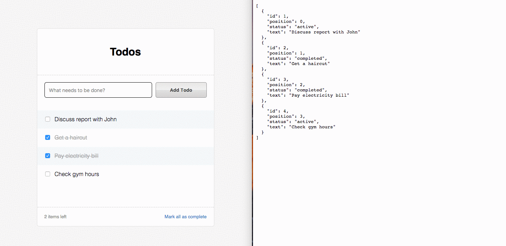

# Todo

Build a todo-list with the following features:

- Add todos
- Toggle active/complete status of todo
- Complete all todos
- Reorder todos

Major tech used:

- Backend:  Flask
- Frontend: React + Redux
- Database: PostgreSQL

## Demo



## Prerequisites

Run the following to setup your tools (if you don't have them):

Homebrew (https://brew.sh)
```
$ brew install git
$ brew install postgres
$ brew install python
$ brew install node
```

PIP (https://pip.pypa.io/en/stable/)
```
$ sudo easy_install pip        # if you don't have pip
$ sudo pip install virtualenv
```

Database (http://brewformulas.org/Postgresql)
```
$ brew services start postgres # start up Postgres on port 5432
$ psql                         # check if you have a user db
$ createdb `whoami`            # if you don't have a user table setup
```

---

## Backend Setup

To install backend dependencies, in one tab, run the following:

```
$ cd flask-redux-react-todo/server
$ virtualenv venv              # create a virtualenv
$ source .env                  # enable virtualenv
(venv) $ sh setup.sh           # script to install dependencies
```

## Run Backend
```
(venv) $ flask run
```

Go to http://localhost:5000/api/v1/todo/ and you should see 4 entries.

### Bonus - Testing Backend
```
(venv) $ python test_todo.py
```

### Bonus - Reset DB
```
(venv) $ sh reset_db.sh
```

---

## Frontend Setup

To install frontend dependencies, in a separate tab:

```
$ cd flask-redux-react-todo/client
$ npm install
```

## Run Frontend
```
$ npm start
```

Go to http://localhost:8080 and you should see the list.

### Bonus - Testing
```
$ npm run test:watch            # run the tests
```
